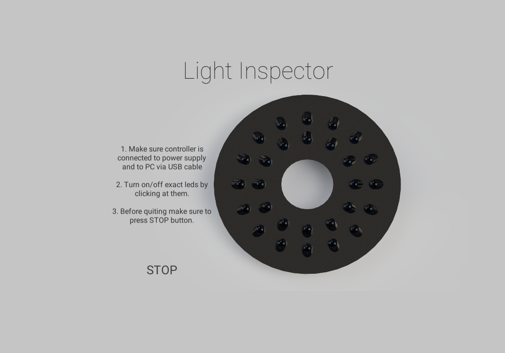

# LightInspector
LightInspector is an app that was made as a part of a graduation work

## Why did I do it?
I decided to do this app because I needed some light to light up bullet for focus-stacking microscope I was developing.
So basicly I decided to create my own illuminator.
I began with 3D project through creating electronic circuit and ending up on creating software.

## How it looks?

## How it works?
Arduino needs to be connected to COM3 port.
After this just simply click on exact LED which you wants to turn on/off
